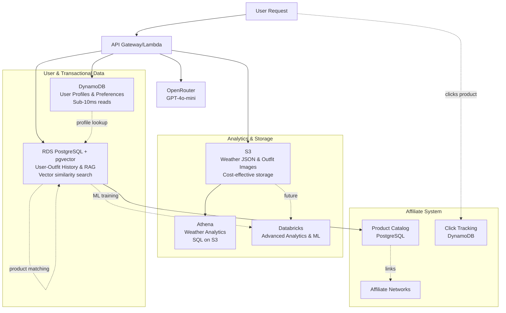

# Weather-Based Outfit Suggestion App Plan

This document outlines the plan for creating a scalable, weather-based outfit suggestion application.

## Technologies
- **Backend:** Python (FastAPI) on AWS Lambda
- **Data Platform:** Databricks (Delta Lake)
- **Orchestration:** Apache Airflow (planned: EC2)
- **Transformation:** dbt
- **Infrastructure:** AWS (Lambda, API Gateway, S3, CloudWatch)
- **CI/CD:** AWS SAM/CloudFormation

## Current Architecture (Week 1-2 Complete)

```mermaid
graph TD
    subgraph AWS Cloud - Current
        A[API Gateway] --> B[Lambda: FastAPI]
        B --> S3[S3 Bucket<br/>Weather + Images]
        B --> CW[CloudWatch Logs]
        B --> LLM[OpenRouter API]
        B --> ATH[Athena<br/>Weather Analytics]
        S3 --> ATH
    end
    
    subgraph Future - Phase 2-3
        DDB[(DynamoDB<br/>User Profiles)]
        PG[(PostgreSQL + pgvector<br/>RAG & History)]
    end
    
    subgraph Monetization - Phase 3.5
        PROD[(Product Catalog<br/>PostgreSQL)]
        AFF[Affiliate Networks<br/>APIs]
        TRACK[(Click Tracking<br/>DynamoDB)]
    end
    
    subgraph Future - Phase 4
        DB[(Databricks<br/>ML & Analytics)]
        AF[Airflow on EC2]
        DBT[dbt Models]
    end
    
    User --> A
    B -.Phase 2.-> DDB
    B -.Phase 3.-> PG
    PG -.RAG vectors.-> PG
    B -.Phase 3.5.-> PROD
    PROD -.affiliate links.-> AFF
    User -.clicks.-> TRACK
    B -.Phase 4.-> DB
    AF -.-> DB
    DBT -.-> DB
    
    style A fill:#90EE90
    style B fill:#90EE90
    style S3 fill:#90EE90
    style CW fill:#90EE90
    style LLM fill:#90EE90
    style ATH fill:#90EE90
```

## Target Architecture (Hybrid Multi-Database)



## Progress Tracker

### ✅ Week 1: AWS Lambda Deployment (COMPLETE)
- [x] Set up the project structure
- [x] Develop the FastAPI application
- [x] Deploy FastAPI to AWS Lambda
- [x] Configure API Gateway
- [x] Set up S3 for data storage
- [x] Integrate with LLM (OpenRouter GPT-4o-mini)
- [x] Infrastructure as Code (AWS SAM)
- [x] CloudWatch logging and monitoring
- [x] Deployment automation scripts
- [x] Documentation for AWS deployment

**Status:** FastAPI app deployed and working on AWS Lambda
**Cost:** $0/month (within free tier)
**URL:** https://e2d6c3y53g.execute-api.us-west-1.amazonaws.com/

### ✅ Week 2: Real Weather Data Integration (COMPLETE)
- [x] Sign up for Weather API service
- [x] Implement real weather API integration
- [x] Store weather data in S3
- [x] Create data lake structure (Bronze/Silver/Gold)
- [x] Update Lambda to use real weather data
- [x] Add data validation and error handling (Pydantic models)
- [x] Implement caching strategy (S3 fallback - memory + S3)
- [x] Create basic analytics queries (AWS Athena with SQL)
- [x] Set up Athena database and table with partition projection
- [x] Create analytics API endpoints (temperature, location trends, summary, conditions)
- [x] Add IAM permissions for Athena and Glue
- [x] Create Glue Crawler role for schema discovery

**Status:** Real weather data integration complete with Athena analytics
**Cost:** ~$1-5/month (Athena queries)
**New Endpoints:** `/analytics/temperature`, `/analytics/location/{location}`, `/analytics/summary`, `/analytics/condition/{condition}`

### ✅ Week 3: Enhanced Features & Validation (COMPLETE)
- [x] Create Pydantic models for weather data validation
- [x] Implement caching strategy (S3 fallback)
- [x] Update `weather_service.py` to fetch forecast data
- [x] Implement missing API endpoints (`/weather/{location}`, `/forecast`, `/history`)
- [x] Enhance `llm_service.py` to include forecast context
- [x] Update documentation with new features

**Status:** API enhanced with forecast data, Pydantic validation, and S3-backed caching.
**New Endpoints:** `/weather/{location}`, `/weather/{location}/forecast`, `/suggest-outfit` (with forecast support)

### ✅ Week 3.5: Basic Front End Implementation (COMPLETE)
- [x] Set up Reflex project structure
- [x] Create responsive UI for outfit suggestions
- [x] Integrate with FastAPI backend
- [x] Add location search and detailed weather metrics grid
- [x] Remove 3-day forecast as per design update

**Status:** Basic front end implemented using Reflex, connected to AWS Lambda API.
**URL:** (Local development) http://localhost:3000

### 📅 Week 4: Airflow Orchestration
- [ ] Launch EC2 t3.micro instance
- [ ] Install and configure Airflow
- [ ] Create weather data ingestion DAG
- [ ] Implement scheduled weather fetching
- [ ] Configure Airflow → S3 → Databricks pipeline
- [ ] Set up monitoring and alerting
- [ ] Document Airflow workflows

### 📅 Week 5: dbt Transformations & Databricks
- [ ] Set up Databricks Community Edition
- [ ] Configure dbt for Databricks
- [ ] Create Delta Lake tables (Bronze/Silver/Gold)
- [ ] Develop dbt models for weather transformations
- [ ] Implement data quality tests
- [ ] Create outfit recommendation logic in SQL
- [ ] Automate dbt runs from Airflow
- [ ] Build analytics dashboard

### 📅 Week 6-8: User Profiles & Authentication
- [ ] Set up DynamoDB tables for users and preferences
- [ ] Implement JWT authentication in FastAPI
- [ ] Create user registration/login endpoints
- [ ] Add user profile management
- [ ] Store style preferences (colors, styles, occasions)
- [ ] Update LLM prompts to include user preferences
- [ ] Track user usage and interactions

### 📅 Week 9-12: RAG & Outfit Learning
- [ ] Launch RDS PostgreSQL with pgvector extension
- [ ] Design schema for outfit catalog and user history
- [ ] Implement outfit image upload to S3
- [ ] Generate image embeddings (AWS Rekognition or OpenAI CLIP)
- [ ] Store embeddings in PostgreSQL for vector search
- [ ] Implement RAG-based outfit recommendations
- [ ] Track user outfit selections and satisfaction ratings
- [ ] Build similarity search for "outfits like this"

### 📅 Week 13-16: Affiliate Monetization
- [ ] Research and select affiliate networks (Amazon, ShopStyle, Rakuten)
- [ ] Sign up for affiliate programs
- [ ] Create product catalog schema in PostgreSQL
- [ ] Build product ingestion pipeline
- [ ] Generate product embeddings for similarity matching
- [ ] Implement product-to-outfit matching algorithm
- [ ] Add affiliate click tracking in DynamoDB
- [ ] Create click-through tracking endpoint
- [ ] Set up conversion webhook listeners
- [ ] Build affiliate analytics dashboard
- [ ] Update LLM prompts to include product recommendations
- [ ] A/B test product presentation strategies

### 📅 Future Enhancements (Phase 4+)
- [ ] Databricks integration for ML models
- [ ] Weather prediction integration
- [ ] Mobile app interface
- [ ] A/B testing framework for outfit suggestions
- [ ] Advanced machine learning for personalized recommendations
- [ ] User cohort analysis
- [ ] Predictive outfit suggestions

---

## Week 3 Detailed Plan: Enhanced Features & Validation

### Milestone: Robust API & Enhanced Suggestions

**Timeline:** 1 week
**Goal:** Add data validation, forecast capabilities, and improve outfit suggestions.

---

### Phase 1: Data Validation (Day 1)

#### Task 1.1: Create Pydantic Models
**File:** `app/models/weather.py`

**Implementation:**
```python
from pydantic import BaseModel

class WeatherCondition(BaseModel):
    text: str
    icon: str
    code: int

class CurrentWeather(BaseModel):
    temp_c: float
    condition: WeatherCondition
    wind_kph: float
    humidity: int

class WeatherResponse(BaseModel):
    location: dict
    current: CurrentWeather
```

**Action Items:**
1. Create `app/models` directory
2. Define models for current weather and forecast
3. Update services to use these models

### Phase 2: Forecast Integration (Days 2-3)

#### Task 2.1: Update Weather Service
**File:** `app/services/weather_service.py`

**Changes:**
- Update `get_weather_data` to accept a `days` parameter
- Fetch forecast data from WeatherAPI
- Store forecast data in S3

#### Task 2.2: Enhance LLM Service
**File:** `app/services/llm_service.py`

**Changes:**
- Update prompt to include forecast data
- Consider temperature changes and precipitation probability

### Phase 3: API Expansion (Days 4-5)

#### Task 3.1: Implement New Endpoints
**File:** `app/main.py`

**New Endpoints:**
- `GET /weather/{location}`: Returns current weather
- `GET /weather/{location}/forecast`: Returns forecast
- `GET /weather/history/{location}`: Returns historical data (from S3)

### Phase 4: Caching & Documentation (Day 6)

#### Task 4.1: S3 Fallback Caching
- Implement logic to check S3 for recent data if API fails or for caching purposes.

#### Task 4.2: Documentation
- Update API documentation (Swagger/OpenAPI)
- Update README.md

---

## Week 2 Detailed Plan: Real Weather Data Integration (Completed)

#### Task 1.1: Select and Configure Weather API
**Options to evaluate:**
- **WeatherAPI.com** (Recommended)
  - Free tier: 1M requests/month
  - Real-time + forecast data
  - Easy integration
  
- **OpenWeatherMap**
  - Free tier: 60 calls/minute
  - Historical data available
  - Large community

- **Weather.gov (NOAA)**
  - Completely free
  - US-only
  - No API key needed

**Action Items:**
1. Sign up for chosen service
2. Get API key
3. Store in AWS Secrets Manager (or Lambda env vars)
4. Test API calls locally

**Success Criteria:**
- API key obtained
- Sample API call returns valid data
- Cost estimation verified

#### Task 1.2: Update Weather Service Implementation
**File:** `app/services/weather_service.py`

**Changes needed:**
```python
# Replace mock data with real API calls
async def get_weather_data(location: str):
    weather_api_url = f"https://api.weatherapi.com/v1/current.json"
    params = {
        "key": get_api_key(),
        "q": location,
        "aqi": "no"
    }
    
    async with httpx.AsyncClient() as client:
        response = await client.get(weather_api_url, params=params)
        
        if response.status_code != 200:
            raise HTTPException(...)
        
        # Store raw data in S3
        await store_raw_weather_data(location, response.json())
        
        return response.json()
```

**Success Criteria:**
- Real weather data returned for test locations
- Error handling for invalid locations
- Response time < 500ms

---

### Phase 2: S3 Data Lake Structure (Days 3-4)

#### Task 2.1: Design Data Lake Architecture

**Structure:**
```
s3://fitted-weather-data-{account-id}/
├── raw/                          # Bronze layer
│   └── weather/
│       └── dt=2024-11-24/
│           └── location=san_francisco/
│               └── 14-30-00.json
├── processed/                    # Silver layer
│   └── weather_daily/
│       └── year=2024/
│           └── month=11/
│               └── day=24/
│                   └── data.parquet
└── analytics/                    # Gold layer
    ├── location_weather_trends/
    └── outfit_recommendations/
```

**Action Items:**
1. Create S3 prefixes structure
2. Implement partitioning strategy
3. Set up lifecycle policies (30-day retention for raw)

#### Task 2.2: Implement S3 Storage Functions

**New file:** `app/services/storage_service.py`

```python
async def store_raw_weather_data(location: str, data: dict):
    """Store raw weather API response in S3"""
    timestamp = datetime.utcnow()
    key = f"raw/weather/dt={timestamp.strftime('%Y-%m-%d')}/location={location}/{timestamp.strftime('%H-%M-%S')}.json"
    
    await s3_client.put_object(
        Bucket=WEATHER_BUCKET,
        Key=key,
        Body=json.dumps(data),
        ContentType='application/json'
    )
```

**Success Criteria:**
- Weather data stored in S3 after each API call
- Partitioned by date and location
- Queryable with S3 Select

---

### Phase 3: Data Processing & Analytics (Days 5-7)

#### Task 3.1: Create Data Validation

**New file:** `app/services/validation_service.py`

```python
def validate_weather_data(data: dict) -> bool:
    """Validate weather API response structure"""
    required_fields = [
        'location.name',
        'current.temp_c',
        'current.condition.text'
    ]
    # Implementation...
```

**Action Items:**
1. Define data schema
2. Implement validation rules
3. Log validation failures
4. Alert on data quality issues

#### Task 3.2: Implement Caching Strategy

**Approach:**
- Cache weather data in Lambda memory (15 min TTL)
- Use S3 as backup cache for same location/hour
- Reduce API calls by 80-90%

**Implementation:**
```python
@lru_cache(maxsize=100)
async def get_cached_weather(location: str, hour: str):
    """Get weather with caching"""
    # Check memory cache
    # Check S3 recent data
    # Call API if needed
```

**Success Criteria:**
- API calls reduced by 80%
- Response time improved
- Cost savings validated

#### Task 3.3: Basic Analytics Queries

**Create SQL queries for:**
1. Weather trends by location
2. Temperature patterns over time
3. Most requested locations
4. API usage statistics

**Tools:**
- S3 Select for simple queries
- Athena for complex analytics (optional)
- Store results for dashboard

---

### Phase 4: Enhanced Lambda Function (Days 8-10)

#### Task 4.1: Add New Endpoints

**New endpoints:**
```python
@app.get("/weather/{location}")
async def get_current_weather(location: str):
    """Get current weather only"""

@app.get("/weather/{location}/forecast")
async def get_forecast(location: str, days: int = 3):
    """Get weather forecast"""

@app.get("/weather/history/{location}")
async def get_historical(location: str, days: int = 7):
    """Get recent weather history from S3"""
```

**Action Items:**
1. Implement new endpoints
2. Add request validation
3. Document API responses
4. Update OpenAPI schema

#### Task 4.2: Improve Outfit Suggestions

**Enhancements:**
```python
async def get_outfit_suggestion_enhanced(
    location: str,
    temp_c: float,
    condition: str,
    forecast: list
):
    """Enhanced suggestions with forecast context"""
    prompt = f"""
    Current: {temp_c}°C, {condition}
    Forecast next 3 hours: {forecast}
    
    Suggest outfit considering:
    - Temperature changes
    - Precipitation probability
    - Day/evening activities
    """
```

**Action Items:**
1. Use forecast data for better suggestions
2. Add time-of-day context
3. Consider weather trends
4. Personalization hooks for future

---

### Phase 5: Monitoring & Testing (Days 11-14)

#### Task 5.1: Enhanced Monitoring

**CloudWatch Metrics:**
- Weather API call count
<br>- S3 storage usage
- Lambda execution duration
- Error rates by type
- Cost tracking

**Alarms:**
- API failures exceed 5%
- S3 storage > 4GB (approaching free tier)
- Lambda errors > 10/hour
- Unusual cost spikes

#### Task 5.2: Comprehensive Testing

**Test scenarios:**
1. Valid location requests
2. Invalid location handling
3. API timeout handling
4. Rate limit scenarios
5. S3 storage failures
6. Cache hit/miss ratios
7. Load testing (100 concurrent requests)

**Tools:**
- pytest for unit tests
- locust for load testing
- AWS X-Ray for tracing

#### Task 5.3: Documentation Updates

**Update files:**
- README.md - Architecture diagram with S3
- API documentation - New endpoints
- Deployment guide - Environment variables
- Cost analysis - Updated estimates

---

### Success Criteria for Week 2

**Functional:**
- ✅ Real weather data integrated for 50+ cities
- ✅ Weather data stored in S3 with proper partitioning
- ✅ Caching reduces API calls by 80%
- ✅ Error handling for all failure scenarios
- ✅ Response time < 300ms for cached data

**Technical:**
- ✅ S3 data lake structure implemented
- ✅ Data validation in place
- ✅ CloudWatch dashboards created
- ✅ Automated testing suite (80% coverage)
- ✅ Documentation updated

**Operational:**
- ✅ Cost remains under $5/month
- ✅ 99.9% uptime maintained
- ✅ Monitoring alerts configured
- ✅ Deployment process documented

---

### Deliverables

1. **Updated Lambda Function**
   - Real weather API integration
   - S3 storage implementation
   - Enhanced error handling
   - New API endpoints

2. **S3 Data Lake**
   - Bronze/Silver/Gold structure
   - Partitioned weather data
   - Lifecycle policies
   - Query examples

3. **Testing Suite**
   - Unit tests (80% coverage)
   - Integration tests
   - Load test results
   - Performance benchmarks

4. **Documentation**
   - API documentation (OpenAPI)
   - Architecture diagrams
   - Deployment guide updates
   - Cost analysis

5. **Monitoring**
   - CloudWatch dashboards
   - Alerts configured
   - Performance metrics
   - Cost tracking

---

### Risk Mitigation

**Risk 1: Weather API rate limits**
- Mitigation: Implement aggressive caching
- Fallback: Use multiple API providers
- Monitoring: Track API usage hourly

**Risk 2: S3 costs exceed budget**
- Mitigation: Lifecycle policies (30-day deletion)
- Monitoring: Daily cost alerts
- Fallback: Reduce data retention

**Risk 3: Lambda timeout with S3 writes**
- Mitigation: Async S3 writes, don't block response
- Fallback: Use SQS queue for S3 writes
- Monitoring: Track Lambda duration

**Risk 4: Data quality issues**
- Mitigation: Validation before storage
- Monitoring: Data quality dashboard
- Fallback: Manual data review process

---

### Next Steps After Week 2

**Week 3 Preview:**
- EC2 Airflow setup
- Scheduled batch processing
- Airflow → S3 → Databricks pipeline
- Automated data quality checks

**Long-term Vision:**
- Machine learning for outfit recommendations
- User preference learning
- Historical trend analysis
- Predictive outfit suggestions

---

## Resources

### Weather APIs
- [WeatherAPI.com Documentation](https://www.weatherapi.com/docs/)
- [OpenWeatherMap API](https://openweathermap.org/api)
- [NOAA Weather API](https://www.weather.gov/documentation/services-web-api)

### AWS Documentation
- [S3 Best Practices](https://docs.aws.amazon.com/AmazonS3/latest/userguide/best-practices.html)
- [Lambda Performance](https://docs.aws.amazon.com/lambda/latest/dg/best-practices.html)
- [CloudWatch Metrics](https://docs.aws.amazon.com/AmazonCloudWatch/latest/monitoring/working_with_metrics.html)

### Data Lake Patterns
- [Medallion Architecture](https://www.databricks.com/glossary/medallion-architecture)
- [Data Lake Best Practices](https://aws.amazon.com/big-data/datalakes-and-analytics/)

---

## Databricks Configuration

To configure the Databricks CLI, you will need your Databricks host URL and a personal access token (PAT).

### Finding Your Databricks Host

1.  Log in to your Databricks workspace.
2.  The URL in your browser's address bar is your Databricks host. It will look something like `https://<your-workspace-name>.cloud.databricks.com`.

### Generating a Personal Access Token

1.  In your Databricks workspace, click on your username in the top right corner and select **User Settings**.
2.  Go to the **Access tokens** tab.
3.  Click the **Generate new token** button.
4.  Give your token a descriptive name (e.g., "Fitted Wardrobe App") and set an appropriate lifetime for the token.
5.  Click **Generate**.
6.  **Important:** Copy the generated token immediately and store it in a secure location. You will not be able to see it again.

### Configuring the CLI

Once you have your host and token, run the following command in your terminal:

```bash
databricks configure --token
```

You will be prompted to enter your Databricks host and token.

---

## User Profile & RAG Architecture (NEW)

### Overview

Starting in Week 6, we're adding user profiles and RAG-based personalization to the application. This requires a hybrid multi-database architecture.

### Data Model

#### DynamoDB Tables

**users table:**
```json
{
  "user_id": "uuid-123",
  "email": "user@example.com",
  "name": "Jane Doe",
  "created_at": "2024-01-15T10:00:00Z",
  "last_login": "2024-01-20T15:30:00Z"
}
```

**user_preferences table:**
```json
{
  "user_id": "uuid-123",
  "style_preferences": {
    "colors": ["blue", "green", "neutral"],
    "styles": ["casual", "business-casual"],
    "occasions": ["work", "weekend"],
    "avoid": ["bright-colors", "formal"]
  },
  "size_info": {
    "top": "M",
    "bottom": "32",
    "shoe": "10"
  }
}
```

#### PostgreSQL Schema (with pgvector)

```sql
-- Outfit catalog with vector embeddings for RAG
CREATE TABLE outfits (
  outfit_id UUID PRIMARY KEY,
  name VARCHAR(255),
  description TEXT,
  image_s3_path VARCHAR(500),
  embedding VECTOR(512),  -- pgvector for semantic similarity
  style_tags TEXT[],
  created_at TIMESTAMP
);

-- User outfit selection history
CREATE TABLE user_outfit_history (
  id SERIAL PRIMARY KEY,
  user_id UUID,
  outfit_id UUID REFERENCES outfits(outfit_id),
  weather_temp_c FLOAT,
  weather_condition VARCHAR(100),
  location VARCHAR(100),
  satisfaction_score INT,  -- 1-5 rating
  worn_date DATE,
  created_at TIMESTAMP
);

-- Vector similarity index
CREATE INDEX ON outfits USING ivfflat (embedding vector_cosine_ops);
```

### RAG Implementation

**How it works:**
1. User selects outfit images they like (stored in S3)
2. Generate embeddings using AWS Rekognition or OpenAI CLIP
3. Store embeddings in PostgreSQL with pgvector
4. When suggesting outfits, find similar ones based on:
   - User's past selections (vector similarity)
   - Current weather conditions
   - User style preferences

**Example RAG query:**
```sql
-- Find outfits similar to what user liked in similar weather
SELECT o.*,
       o.embedding <=> $query_embedding AS similarity
FROM outfits o
JOIN user_outfit_history uoh ON o.outfit_id = uoh.outfit_id
WHERE uoh.user_id = $user_id
  AND uoh.satisfaction_score >= 4
  AND ABS(uoh.weather_temp_c - $current_temp) < 5.0
ORDER BY similarity
LIMIT 10;
```

### Cost Estimates & Revenue Projections

| Phase | Services | Monthly Cost | Revenue Potential |
|-------|----------|--------------|-------------------|
| Current (Weather only) | Lambda + S3 + Athena | $1-5 | $0 |
| + User Profiles | + DynamoDB | $6-15 | $0 |
| + RAG | + RDS PostgreSQL | $21-45 | $0 |
| + Affiliates | + Click tracking | $26-50 | **$75-750** |
| + ML Platform | + Databricks | $176-250 | $750+ |

**Affiliate Revenue Model:**
- Average order value: $100
- Commission rate: 5% average
- Conversion rate: 2-5%
- Revenue at 1,000 active users: ~$75/month
- Revenue at 10,000 active users: ~$750/month

**Break-even:**
- With affiliates: 350-700 active users
- With ML platform: 2,500-3,500 active users

### Implementation Timeline

- **Weeks 1-2:** Weather analytics with Athena ✅ (COMPLETE)
- **Weeks 3-5:** Enhanced features & validation 🔄 (IN PROGRESS)
- **Weeks 6-8:** User profiles with DynamoDB
- **Weeks 9-12:** RAG with PostgreSQL + pgvector
- **Weeks 13-16:** Affiliate monetization
- **Month 4+:** Databricks ML integration

### Key Technologies

- **DynamoDB:** Fast user lookups, serverless scaling
- **PostgreSQL + pgvector:** Relational data + vector similarity search
- **S3:** Weather data + outfit images
- **Athena:** SQL analytics on weather data
- **Databricks:** Advanced ML (future phase)

### Affiliate Networks

**Recommended Networks:**
1. **Amazon Associates** - Largest selection, 1-10% commission
2. **ShopStyle Collective** - Fashion-focused, good UI
3. **Rakuten Advertising** - Mid-tier brands, 5-15% commission
4. **Commission junction** - Many retailers
5. **ShareASale** - Indie brands, niche fashion

**Integration Strategy:**
- Start with Amazon (easy integration, broad catalog)
- Add ShopStyle for fashion-specific items
- Expand to others based on conversion data

For detailed analysis of alternatives, see [`s3-query-alternatives-updated.md`](s3-query-alternatives-updated.md).

### Related Documentation

- **Athena Setup:** [`docs/ATHENA_SETUP.md`](docs/ATHENA_SETUP.md) - Complete guide for AWS Athena analytics
- **Phase 2 Summary:** [`docs/personal/PHASE2_COMPLETION.md`](docs/personal/PHASE2_COMPLETION.md) - Week 2 implementation details
- **Architecture Analysis:** [`s3-query-alternatives-updated.md`](s3-query-alternatives-updated.md) - Database strategy and comparisons
