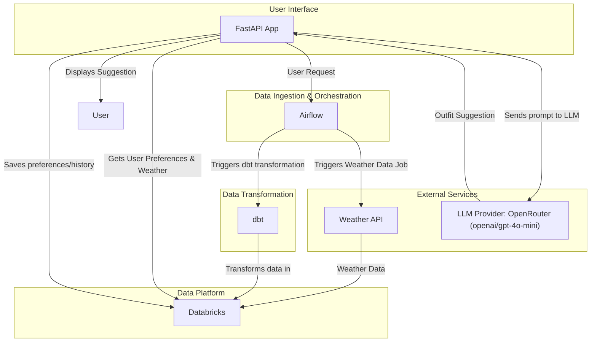

# Weather-Based Outfit Suggestion App Plan

This document outlines the plan for creating a scalable, weather-based outfit suggestion application.

## Technologies
- Python (FastAPI)
- Databricks
- Airflow
- dbt

## High-Level Architecture



## TODO

- [x] Set up the project structure
- [x] Develop the FastAPI application
- [x] Integrate with a weather API
- [x] Set up the Databricks environment
- [x] Develop dbt models
- [ ] Create Airflow DAGs
- [x] Integrate with a Large Language Model (LLM)
- [ ] Implement user preference storage
- [ ] Implement NOAA weather API

## Databricks Configuration

To configure the Databricks CLI, you will need your Databricks host URL and a personal access token (PAT).

### Finding Your Databricks Host

1.  Log in to your Databricks workspace.
2.  The URL in your browser's address bar is your Databricks host. It will look something like `https://<your-workspace-name>.cloud.databricks.com`.

### Generating a Personal Access Token

1.  In your Databricks workspace, click on your username in the top right corner and select **User Settings**.
2.  Go to the **Access tokens** tab.
3.  Click the **Generate new token** button.
4.  Give your token a descriptive name (e.g., "Fitted Wardrobe App") and set an appropriate lifetime for the token.
5.  Click **Generate**.
6.  **Important:** Copy the generated token immediately and store it in a secure location. You will not be able to see it again.

### Configuring the CLI

Once you have your host and token, run the following command in your terminal:

```bash
databricks configure --token
```

You will be prompted to enter your Databricks host and token.
