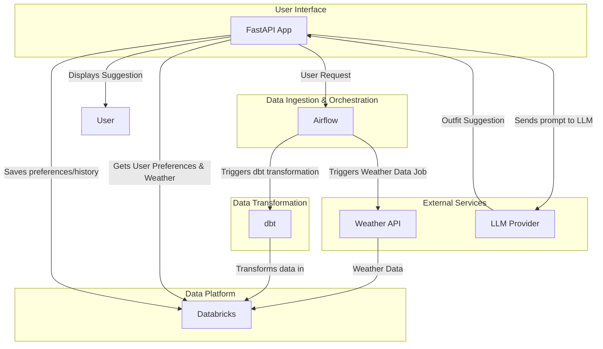

# Weather-Based Outfit Suggestion App Plan

This document outlines the plan for creating a scalable, weather-based outfit suggestion application.

## Technologies
- Python (FastAPI)
- Databricks
- Airflow
- dbt

## High-Level Architecture

## TODO

- [ ] Set up the project structure
- [ ] Develop the FastAPI application
- [ ] Integrate with a weather API
- [ ] Set up the Databricks environment
- [ ] Develop dbt models
- [ ] Create Airflow DAGs
- [ ] Integrate with a Large Language Model (LLM)
- [ ] Implement user preference storage
