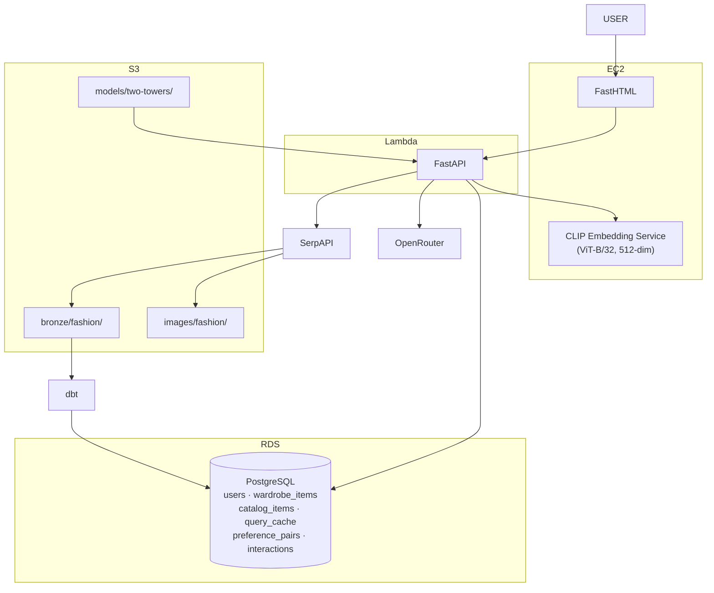

# Fitted — Engineering Plan

**Status:** Week 6 core complete — preference reranker + interaction endpoints pending
**Stack:** FastHTML on EC2 · FastAPI on Lambda · PostgreSQL + pgvector on RDS · S3 · CLIP ViT-B/32

---

## Architecture

### Deployment Topology

| Layer | Service | Notes |
|---|---|---|
| Frontend | FastHTML on EC2 (t4g.micro) | Caddy TLS termination, systemd |
| API | FastAPI on AWS Lambda | Thin — no ML inference runs here |
| Embedding | CLIP service on EC2 | Sidecar to frontend; Lambda calls it via internal HTTP |
| Database | RDS PostgreSQL 16 + pgvector (db.t4g.micro) | HNSW index for ANN search |
| Object store | S3 | Weather data, wardrobe images, product thumbnails, bronze/silver catalog |
| Secrets | SSM Parameter Store | API keys, DB password |

> **Why CLIP lives on EC2, not Lambda:** CLIP ViT-B/32 is ~340MB. Lambda's unzipped package limit is 250MB, and container Lambda cold starts with a model this size run 5–10s. EC2 keeps the model warm permanently at no extra cost since the instance is already running.

### Request Flow (Recommendation)

```
User → FastHTML (EC2)
     → POST /recommend (Lambda via API Gateway)
          → LLM (OpenRouter): generate search query from preferences + weather
          → VectorCache.lookup(query_embedding): pgvector semantic search on query_cache
               ├── HIT  → return cached candidates
               └── MISS → SerpAPI → persist thumbnails to S3
                                  → CLIP embed via EC2 embedding service
                                  → upsert catalog_items
                                  → cache query embedding
          → TwoTowers.rank(user_embedding, candidates)
          → PreferenceReranker.rerank(candidates, preference_pairs)
          → LLM: generate natural language explanation
     ← ranked products with explanation
```

### Target Architecture Diagram


```mermaid
graph TD
    subgraph EC2
        FRONT[FastHTML]
        EMBS["CLIP Embedding Service\n(ViT-B/32, 512-dim)"]
    end

    subgraph Lambda
        API[FastAPI]
    end

    subgraph RDS
        PG[("PostgreSQL\nusers · wardrobe_items\ncatalog_items · query_cache\npreference_pairs · interactions")]
    end

    subgraph S3
        BRONZE["bronze/fashion/"]
        IMAGES["images/fashion/"]
        MODELS["models/two-towers/"]
    end

    USER --> FRONT
    FRONT --> API
    API --> EMBS
    API --> PG
    API --> LLM[OpenRouter]
    API --> SERP[SerpAPI]
    SERP --> IMAGES
    SERP --> BRONZE
    BRONZE --> DBT[dbt] --> PG
    MODELS --> API
```

---

## Data Model

```sql
-- Core user tables (Week 4)
CREATE TABLE users (
    user_id     UUID PRIMARY KEY DEFAULT gen_random_uuid(),
    email       VARCHAR(255) UNIQUE NOT NULL,
    hashed_pw   VARCHAR(255) NOT NULL,
    created_at  TIMESTAMPTZ DEFAULT NOW()
);

CREATE TABLE wardrobe_items (
    item_id     UUID PRIMARY KEY DEFAULT gen_random_uuid(),
    user_id     UUID NOT NULL REFERENCES users ON DELETE CASCADE,
    name        VARCHAR(255) NOT NULL,
    category    VARCHAR(50),
    image_s3_key VARCHAR(500),
    tags        TEXT[] DEFAULT '{}',
    embedding   VECTOR(512),              -- CLIP ViT-B/32
    created_at  TIMESTAMPTZ DEFAULT NOW(),
    updated_at  TIMESTAMPTZ DEFAULT NOW()
);
CREATE INDEX ON wardrobe_items USING hnsw (embedding vector_cosine_ops);

-- Product catalog — persists across SerpAPI calls (Week 5)
CREATE TABLE catalog_items (
    item_id       VARCHAR PRIMARY KEY,    -- Google product_id
    domain        VARCHAR NOT NULL,       -- 'fashion' | 'furniture' | ...
    title         TEXT,
    price         FLOAT,
    image_url     TEXT,                   -- own S3 URL after thumbnail copy
    product_url   TEXT,
    source        VARCHAR,               -- 'seed' | 'serpapi' | ...
    embedding     VECTOR(512),
    content_hash  VARCHAR,               -- detect stale items
    first_seen    TIMESTAMPTZ DEFAULT NOW(),
    last_seen     TIMESTAMPTZ DEFAULT NOW(),
    hit_count     INT DEFAULT 1,
    model_version VARCHAR
);
CREATE INDEX ON catalog_items USING hnsw (embedding vector_cosine_ops);

-- Semantic query cache (Week 5)
CREATE TABLE query_cache (
    cache_id        UUID PRIMARY KEY DEFAULT gen_random_uuid(),
    query_hash      VARCHAR UNIQUE NOT NULL,
    query_text      TEXT,
    query_embedding VECTOR(512),
    s3_key          TEXT,
    expires_at      TIMESTAMPTZ
);
CREATE INDEX ON query_cache USING hnsw (query_embedding vector_cosine_ops);

-- Interaction + preference signal (Week 6)
CREATE TABLE user_interactions (
    interaction_id    UUID PRIMARY KEY DEFAULT gen_random_uuid(),
    user_id           UUID REFERENCES users ON DELETE CASCADE,
    product_url       TEXT,
    interaction_type  VARCHAR,           -- 'click' | 'save' | 'dismiss'
    recommendation_score FLOAT,
    weather_context   JSONB,
    query_text        TEXT,
    created_at        TIMESTAMPTZ DEFAULT NOW()
);

CREATE TABLE preference_pairs (
    pair_id     UUID PRIMARY KEY DEFAULT gen_random_uuid(),
    user_id     UUID REFERENCES users ON DELETE CASCADE,
    query_context JSONB,
    item_a_id   VARCHAR,
    item_b_id   VARCHAR,
    preferred   VARCHAR,                 -- item_a_id | item_b_id
    created_at  TIMESTAMPTZ DEFAULT NOW()
);
```

---

## Domain Protocol

All recommendation logic is vertical-agnostic. Swapping from fashion to furniture is a config change + one new `Domain` implementation.

```python
from typing import Protocol
import numpy as np

class Domain(Protocol):
    def encode_query(self, inputs: dict) -> np.ndarray: ...
    def encode_item(self, item: "Item") -> np.ndarray: ...
    def fetch_candidates(self, query: str) -> list["Item"]: ...
    def parse_item(self, raw: dict) -> "Item": ...
    def preference_context(self, query: dict, item: "Item") -> dict: ...

@dataclass
class Item:
    item_id:     str
    domain:      str
    title:       str
    price:       float
    image_url:   str
    product_url: str
    source:      str
    embedding:   np.ndarray | None
    attributes:  dict          # domain-specific overflow
```

`FashionDomain` is the only concrete implementation today. `get_domain(domain: str) -> Domain` factory is driven by `DOMAIN` env var.

---

## Recommendation Pipeline

```
query embedding (CLIP text)
    → vector_cache.lookup(threshold=0.85)         # semantic cache on query_cache table
        ├── HIT  → cached candidates
        └── MISS → SerpAPI → S3 thumbnail persist → CLIP encode → catalog_items upsert → cache

candidates
    → UserTower(wardrobe_embeddings, preferences) → 512-dim user vector
    → ItemTower(clip_image, clip_text)            → 512-dim item vectors
    → cosine similarity → top-K

top-K
    → PreferenceReranker (Bradley-Terry on preference_pairs)
    → LLM explanation (OpenRouter)
    → response
```

**Cold start:** Xavier init on two-towers weights until enough `user_interactions` to train. `scripts/pretrain_item_tower.py` pre-trains on dev catalog CLIP embeddings for a better starting point.

**Training loop (Week 8):** `scripts/train_two_towers.py` — reads interactions, builds triplets, trains with `TripletMarginLoss(margin=0.2)`, writes weights to `s3://fitted/models/two-towers/latest.pt`. MLflow for experiment tracking.

---

## Milestones

### ✅ Week 1 — Lambda + API Gateway
FastAPI on Lambda, S3, CloudWatch, OpenRouter LLM integration, SAM IaC.

### ✅ Week 2 — Weather Data + Athena
WeatherAPI integration, S3 bronze/silver/gold, Athena analytics endpoints.

### ✅ Week 3 — API Hardening + Frontend
Pydantic validation, forecast support, FastHTML frontend, S3-backed caching.

### 🔄 Week 4 — EC2 + RDS + Auth + Wardrobe
- [x] SSH key, SSM secrets
- [x] CloudFormation: VPC (IPv6), EC2 t4g.micro (Elastic IP), RDS db.t4g.micro (PostgreSQL 16 + pgvector), security groups, IAM
- [x] DB schema: `users`, `wardrobe_items` (VECTOR(512)), HNSW index, `updated_at` trigger, psycopg async pool
- [x] EC2 deploy: Caddy (COPR), systemd services, Caddyfile, `config.py` SSM support, FastHTML prod mode
- [ ] Auth + Wardrobe API: JWT (dev bypass when `DEV_MODE=true`), S3 presign/upload/delete, `/auth/*` and `/wardrobe/*`
- [ ] Tests: psycopg3 cursor mocks, moto S3, auth + wardrobe coverage
- [ ] Frontend: login/register, nav, upload form, gallery, HTMX delete
- [ ] User preferences: JSONB style prefs (colors, styles, occasions), LLM prompt integration

**Cost:** $0 during free tier · ~$3.60/mo Elastic IP · ~$18/mo post-free-tier

### ✅ Week 5 — Embeddings + Candidate Sources

**5A — CLIP Embedding Service**
- [x] `app/services/embedding_service.py` — CLIP ViT-B/32 text encoder; lazy-import singleton; `encode_text(text) -> np.ndarray` (512-dim L2-normalized); `reset_model_for_testing()`
- [ ] `scripts/backfill_wardrobe_embeddings.py` — backfill `wardrobe_items.embedding` for existing photos (deferred; no wardrobe photos exist yet)
- [ ] `encode_image(url_or_s3_key)` — image encoder path (deferred; Lambda 250MB limit; will run on EC2 sidecar)

**5A.5 — Domain Protocol**
- [x] `app/services/domain.py` — `@runtime_checkable` `Domain` Protocol with `encode_query`, `encode_item`, `parse_item`, `preference_context`
- [x] `app/models/item.py` — canonical `Item` dataclass (512-dim `np.ndarray | None` embedding)
- [x] `app/services/domains/fashion.py` — `FashionDomain`: composite weather+style query strings, cached embedding fast path, DB row parsing
- [x] `app/services/domain_factory.py` — `_REGISTRY` dict + `get_domain(name)` factory via `DOMAIN` env var

**5B — Dev Catalog (Poshmark seed)**
- [x] Poshmark ingestion scripts — seeded `catalog_items` with Poshmark listings (`source='poshmark_seed'`)
- [x] `scripts/backfill_catalog_embeddings.py` — CLIP text-encodes all `catalog_items` where `embedding IS NULL`; idempotent; run via SSH tunnel to RDS; **backfill complete**
- [x] `app/services/dev_catalog_service.py` — pgvector ANN on `catalog_items` (embedding IS NOT NULL); recency fallback; used when `DEV_MODE=true`

**5C — Vector Cache + LLM Query Generation**
- [x] `app/services/vector_cache.py` — `lookup(query_embedding, threshold=0.15)` + `store(...)`; cosine distance ANN on `query_cache`; S3-backed candidate serialization; 24h TTL; `ON CONFLICT` upsert
- [x] `app/services/candidate_source.py` — factory routing `DEV_MODE=true` → dev catalog; prod path stub (returns `[]` with warning)
- [x] `llm_service.generate_search_query(preferences, weather) -> str` — 5–10 word NL query; rule-based fallback
- [ ] `app/services/serpapi_service.py` — live product search for prod path (deferred to Week 5C remainder)

### 🔄 Week 6 — Two-Towers + Preference Re-ranker

**Two-Tower Model (complete)**
- [x] `app/models/product.py` — `ProductRecommendation` Pydantic model with `similarity_score`, optional `llm_explanation`
- [x] `app/services/recommendation_service.py`:
  - `UserTower` / `ItemTower` — 512→512 linear projection; Xavier uniform init; loads pre-trained weights from `s3://fitted/models/two-towers/latest.pt`
  - `RecommendationService._build_user_embedding` — mean-pools wardrobe embeddings; falls back to style/color tag encoding; falls back to generic "casual everyday clothing"
  - `RecommendationService.rank` — encodes items via `FashionDomain.encode_item`, projects through `ItemTower`, scores by dot product (cosine similarity)
  - `RecommendationService.recommend` — full pipeline: LLM query → CLIP embed → vector cache → ANN → rank → optional explanation → `ProductRecommendation` list
  - Module-level singleton: `init_recommendation_service()` / `get_recommendation_service()`
- [x] `app/main.py` — lifespan calls `init_recommendation_service()` after DB pool; `GET /catalog/search`; `POST /recommend-products` (JWT-authenticated; weather + prefs fetched concurrently)
- [x] `tests/test_recommendation_service.py` — 31 tests across UserTower, ItemTower, `rank`, `_build_user_embedding`, `recommend`, singleton lifecycle
- [x] `llm_service.generate_explanation(top_items, weather_context, style_preferences) -> str` — 2–3 sentence explanation; gated behind `include_explanation=True`

**Pending**
- [ ] `app/services/preference_reranker.py` — Bradley-Terry on `preference_pairs`; `rerank(query, candidates)`, `update(pairs)`
- [ ] `POST /interactions` — log click/save/dismiss events to `user_interactions`
- [ ] `POST /preferences/pairs` — record pairwise preference signals
- [ ] `tests/test_preference_reranker.py`
- [ ] `scripts/pretrain_item_tower.py` — pre-train ItemTower on dev catalog embeddings (optional; Xavier init acceptable until Week 8)

### Week 7 — LLM Explanation + Product Cards
- [x] `llm_service.generate_explanation` — narrates top-3 picks (implemented in Week 6 alongside `recommend`)
- [ ] `product_card(product) -> Div` in `frontend/app.py`; HTMX click → `POST /interactions`

### Week 8 — Training Pipeline
- [ ] `scripts/train_two_towers.py` — interactions → triplets → `TripletMarginLoss(margin=0.2)` → `s3://fitted/models/two-towers/latest.pt`
- [ ] MLflow experiment tracking

### Weeks 13–16 — Affiliate Monetization
- [ ] Affiliate network integrations: Amazon Associates, ShopStyle, Rakuten
- [ ] Click-through tracking on `user_interactions`
- [ ] Conversion webhook listeners
- [ ] A/B test product card presentation

---

## Cost Model

| Phase | Services | $/mo | Revenue potential |
|---|---|---|---|
| Weeks 1–3 (done) | Lambda + S3 + Athena | $1–5 | — |
| Week 4 | + EC2 + RDS | $0 free tier → $18 | — |
| Week 5 | + CLIP service on EC2 | same instance | — |
| Week 6+ | + MLflow/Airflow on EC2 | $50–80 | — |
| Weeks 13–16 | + affiliate tracking | $55–85 | **$75–750** at 1K–10K users |

**Break-even:** ~500 active users at 3% conversion on $100 AOV with 5% commission.

---

## Key Decisions Log

| Decision | Choice | Rationale |
|---|---|---|
| Embedding model | CLIP ViT-B/32 (512-dim) | Unified image+text space; no fusion layer needed |
| CLIP deployment | EC2 sidecar, not Lambda | Lambda 250MB limit + cold start latency |
| Dev catalog | Poshmark seed (ingestion scripts) | Real secondhand listings; no SerpAPI spend during dev |
| Vector cache | pgvector cosine distance threshold 0.15 (≈ similarity 0.85) | Reuse candidates for semantically similar queries; cut CLIP encode cost |
| Two-tower init | Xavier uniform (cold start) | Retrieval is semantically meaningful; ranking quality improves after Week 8 training |
| ML platform | S3 + dbt + Airflow on EC2 | No need for Databricks at this scale |
| Multi-vertical | Domain Protocol | Swap fashion → furniture via config; B2B story |
| Re-ranker | Bradley-Terry on preference pairs | Separates objective relevance (two-towers) from subjective taste |
