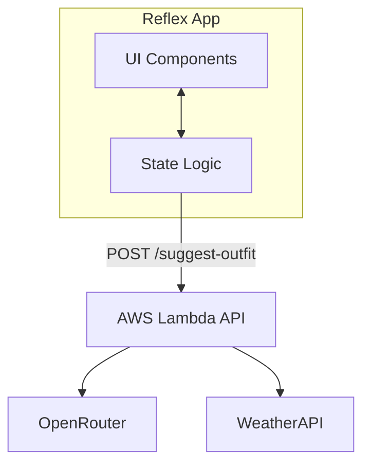

# Reflex Front-End Design Plan

## 1. Architecture Overview

We will build a **Single Page Application (SPA)** using **Reflex**.
- **Frontend:** Pure Python (compiled to React/Next.js by Reflex).
- **Backend Logic:** Reflex State class handles user input and API calls.
- **Data Source:** Connects to your existing AWS Lambda API.

## 2. UI/UX Design (Mobile-First)

The app will use a "mobile-first" layout, centered on the screen with a max-width, ensuring it looks good on both phones and desktops.

### Components
1.  **Header:** Simple "Fitted" branding.
2.  **Search:**
    - Input field: "Enter city (e.g., London)"
    - Action Button: "Get Outfit" (Triggers API)
3.  **Loading State:** A spinner or skeleton loader while fetching data.
4.  **Results Container:**
    - **Weather Card:** Large temperature display, condition icon, and location name.
    - **Metrics Grid:** A grid displaying detailed weather metrics:
        - Humidity (%)
        - Wind Speed (kph/mph)
        - Feels Like (°C/°F)
        - UV Index
    - **Stylist Card:** The LLM's outfit suggestion highlighted in a distinct card.

## 3. State Management (`State` Class)

We will define a `State` class to handle the application logic.

**Variables:**
- `location`: str (Bound to input field)
- `result`: dict (Stores the full JSON response from Lambda)
- `is_loading`: bool (Toggles the loading spinner)
- `error`: str (Stores error messages if API fails)

**Methods:**
- `get_outfit()`:
  1. Sets `is_loading = True`
  2. Clears previous `error`
  3. Makes HTTP POST request to your Lambda URL
  4. Updates `result` with the response
  5. Sets `is_loading = False`

## 4. Implementation Steps

1.  **Setup:** Install `reflex` and initialize the project structure.
2.  **API Client:** Create a helper function to call your Lambda endpoint.
3.  **State Logic:** Implement the `State` class with the variables above.
4.  **UI Construction:** Build the visual components using `rx.vstack`, `rx.card`, and `rx.text`.
5.  **Testing:** Run `reflex run` to test locally.

## 5. Technology Stack Details
- **Framework:** Reflex (Python)
- **Styling:** Tailwind CSS (Built into Reflex)
- **HTTP Client:** `httpx` (Async requests)
