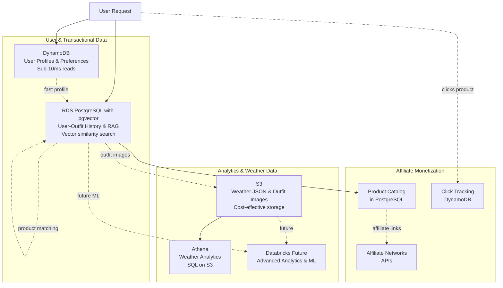

# S3 Query Alternatives Analysis - Updated for User Profiles & RAG

## Executive Summary

Your requirements have expanded beyond simple weather querying to include:
- **User profiles and authentication**
- **Usage tracking and analytics**  
- **Style preferences storage**
- **Outfit image storage**
- **RAG (Retrieval Augmented Generation) for personalized recommendations**

This fundamentally changes the recommended architecture from a single solution to a **hybrid multi-database approach**.

---

## Current Architecture Assessment

**Current Implementation:**
- Storage: S3 bucket with partitioned JSON files (`raw/weather/dt=YYYY-MM-DD/location=city/HH-MM-SS.json`)
- Query Method: `GetObject` + client-side filtering in Python
- Volume: ~Thousands of records per day
- Query Pattern: Occasional (few per hour), simple filters + aggregations
- Latency Requirement: Seconds acceptable

**Problem:**
- S3 Select returns `MethodNotAllowed` error
- Client-side filtering is inefficient (downloads entire file)
- No SQL query capabilities for aggregations
- Scales poorly as data volume grows

---

## New Requirements Analysis

### 🎯 **Additional Data Types & Access Patterns**

**Data Types:**
1. **User Profiles** - Structured data (user_id, name, email, preferences)
2. **Usage Tracking** - Time-series data (logins, queries, outfit selections, clicks)
3. **Style Preferences** - JSON data (colors, styles, occasions, sizes)
4. **Outfit Images** - Binary data (user-selected sample outfits with photos)
5. **Vector Embeddings** - High-dimensional vectors for RAG similarity search
6. **User-Weather-Outfit History** - Relational data (linking users, weather conditions, and outfit choices)
7. **Product Catalog** - Structured data (products with affiliate links, prices, availability)
8. **Affiliate Click Tracking** - Analytics data (click-through rates, conversions, revenue)

**Access Patterns:**
- ⚡ **Fast user profile lookups** (< 100ms) - frequent
- ⚡ **Frequent writes** (usage tracking on every interaction, affiliate clicks)
- 🔍 **Vector similarity search** (finding similar outfits and products for RAG)
- 📊 **Analytics queries** (user behavior, popular styles, weather correlations, conversion rates)
- 🖼️ **Image storage and retrieval** (outfit photos, product images)
- 🌤️ **Weather data queries** (your original use case - occasional)
- 🛍️ **Product recommendations** (match products to outfit suggestions based on preferences)
- 💰 **Affiliate tracking** (click tracking, conversion tracking, revenue attribution)

---

## Recommended Architecture: Hybrid Approach

### 🏗️ **Multi-Database Strategy**



---

### 📦 **Component Breakdown**

#### **1. DynamoDB - User Profiles & Preferences**

**Purpose:** Fast, scalable user authentication and preference storage

**Tables:**
```python
# users table
{
  "user_id": "uuid-123",  # Partition Key
  "email": "user@example.com",
  "name": "Jane Doe",
  "created_at": "2024-01-15T10:00:00Z",
  "last_login": "2024-01-20T15:30:00Z"
}

# user_preferences table  
{
  "user_id": "uuid-123",  # Partition Key
  "style_preferences": {
    "colors": ["blue", "green", "neutral"],
    "styles": ["casual", "business-casual"],
    "occasions": ["work", "weekend"],
    "avoid": ["bright-colors", "formal"]
  },
  "size_info": {
    "top": "M",
    "bottom": "32",
    "shoe": "10"
  },
  "notification_settings": {...}
}
```

**Advantages:**
- ✅ Sub-10ms reads for user lookups
- ✅ Serverless auto-scaling
- ✅ Perfect for auth flows
- ✅ Cost-effective for read-heavy workloads

**Cost:** ~$5-10/month for thousands of users

---

#### **2. RDS PostgreSQL with pgvector - RAG & History**

**Purpose:** Relational queries + vector similarity search for outfit recommendations

**Schema:**
```sql
-- Outfit catalog with vector embeddings
CREATE TABLE outfits (
  outfit_id UUID PRIMARY KEY,
  name VARCHAR(255),
  description TEXT,
  image_s3_path VARCHAR(500),
  embedding VECTOR(512),  -- pgvector for similarity search
  style_tags TEXT[],
  created_at TIMESTAMP
);

-- User outfit selection history
CREATE TABLE user_outfit_history (
  id SERIAL PRIMARY KEY,
  user_id UUID REFERENCES users(user_id),
  outfit_id UUID REFERENCES outfits(outfit_id),
  weather_temp_c FLOAT,
  weather_condition VARCHAR(100),
  location VARCHAR(100),
  satisfaction_score INT,  -- 1-5 rating
  worn_date DATE,
  created_at TIMESTAMP
);

-- Index for vector similarity search
CREATE INDEX ON outfits USING ivfflat (embedding vector_cosine_ops);

-- Product catalog with affiliate links
CREATE TABLE products (
  product_id UUID PRIMARY KEY,
  name VARCHAR(255),
  description TEXT,
  category VARCHAR(100),  -- 'jacket', 'pants', 'shoes', etc.
  brand VARCHAR(100),
  price_usd DECIMAL(10,2),
  image_url VARCHAR(500),
  affiliate_link VARCHAR(500),
  affiliate_network VARCHAR(50),  -- 'amazon', 'shopstyle', 'rakuten', etc.
  embedding VECTOR(512),  -- for similarity matching
  style_tags TEXT[],
  colors TEXT[],
  sizes TEXT[],
  weather_conditions TEXT[],  -- ['cold', 'rainy', 'sunny', etc.]
  gender VARCHAR(20),
  is_active BOOLEAN DEFAULT true,
  created_at TIMESTAMP,
  updated_at TIMESTAMP
);

-- Product-outfit associations
CREATE TABLE outfit_products (
  id SERIAL PRIMARY KEY,
  outfit_id UUID REFERENCES outfits(outfit_id),
  product_id UUID REFERENCES products(product_id),
  category VARCHAR(100),  -- which part of outfit (top, bottom, shoes, etc.)
  created_at TIMESTAMP
);

-- Index for product similarity search
CREATE INDEX ON products USING ivfflat (embedding vector_cosine_ops);
CREATE INDEX ON products (category, is_active);
CREATE INDEX ON products USING GIN (weather_conditions);
```

**DynamoDB Tables for Affiliate Tracking:**
```python
# affiliate_clicks table (DynamoDB for high-write throughput)
{
  "click_id": "uuid-456",  # Partition Key
  "user_id": "uuid-123",
  "product_id": "prod-789",
  "affiliate_network": "amazon",
  "clicked_at": "2024-01-20T15:30:00Z",
  "weather_temp_c": 15.5,
  "weather_condition": "rainy",
  "outfit_context": {
    "outfit_id": "outfit-001",
    "suggestion_type": "weather-based"
  },
  "ttl": 1234567890  # Auto-delete after 90 days
}

# affiliate_conversions table
{
  "conversion_id": "uuid-789",  # Partition Key
  "click_id": "uuid-456",
  "user_id": "uuid-123",
  "product_id": "prod-789",
  "purchase_amount_usd": 89.99,
  "commission_usd": 7.20,
  "converted_at": "2024-01-20T16:45:00Z",
  "status": "confirmed"  # pending, confirmed, rejected
}
```

**RAG Query Example:**
```sql
-- Find similar outfits to what user liked in similar weather
SELECT o.*, 
       o.embedding <=> query_embedding AS similarity
FROM outfits o
JOIN user_outfit_history uoh ON o.outfit_id = uoh.outfit_id
WHERE uoh.user_id = 'uuid-123'
  AND uoh.satisfaction_score >= 4
  AND ABS(uoh.weather_temp_c - 15.0) < 5.0
ORDER BY o.embedding <=> query_embedding
LIMIT 10;
```

**Advantages:**
- ✅ Full SQL for complex queries
- ✅ pgvector for semantic search (no separate vector DB needed)
- ✅ ACID transactions for data consistency
- ✅ Join user history with weather data
- ✅ PostgreSQL is battle-tested and well-understood

**Cost:** ~$15-30/month (t4g.micro for development)

---

#### **3. S3 - Weather Data & Outfit Images**

**Purpose:** Cost-effective storage for time-series weather data and images

**Structure:**
```
s3://fitted-bucket/
├── weather/
│   └── raw/dt=2024-01-15/location=sf/14-30-00.json
├── outfit-images/
│   ├── user-uploaded/{user_id}/{outfit_id}.jpg
│   └── catalog/{outfit_id}.jpg
└── embeddings-cache/
    └── {image_hash}.npy
```

**Advantages:**
- ✅ Extremely cost-effective ($0.023/GB/month)
- ✅ Unlimited scalability
- ✅ Perfect for large binary files (images)
- ✅ Integration with Athena for analytics

**Cost:** ~$1-3/month for moderate usage

---

#### **4. Athena - Weather Analytics**

**Purpose:** SQL queries on S3 weather data without loading into database

**Use Cases:**
- Historical weather trend analysis
- Correlating weather patterns with outfit choices
- Generating reports for data science team

**Example Query:**
```sql
SELECT 
  location.name,
  DATE_TRUNC('day', dt) as date,
  AVG(current.temp_c) as avg_temp,
  COUNT(*) as num_readings
FROM weather_data
WHERE dt >= DATE '2024-01-01'
GROUP BY location.name, DATE_TRUNC('day', dt)
ORDER BY date DESC;
```

**Advantages:**
- ✅ No data movement required
- ✅ Only pay for data scanned ($5/TB)
- ✅ Serverless - no infrastructure
- ✅ Leverages existing S3 partitions

**Cost:** ~$1-5/month for occasional queries

---

#### **5. Databricks (Future Phase)**

**Purpose:** Advanced ML and analytics when you're ready to scale

**Deferred to Phase 4:**
- Training personalized recommendation models
- A/B testing analysis
- User cohort analysis
- Predictive outfit suggestions

**Cost:** ~$150-200/month (implement when revenue justifies it)

---

## Alternative Architectures Considered

### ❌ **Option A: PostgreSQL Only**

**Idea:** Use PostgreSQL for everything (users, preferences, weather, vectors)

**Pros:**
- Simpler architecture (one database)
- Full SQL everywhere
- pgvector for RAG

**Cons:**
- ❌ Always-on cost ($15-30/month even when idle)
- ❌ Less scalable for user lookups vs DynamoDB
- ❌ Lambda connection pooling complexity
- ❌ Weather time-series data bloats database
- ❌ Not cost-effective for infrequent weather queries

**Verdict:** Could work for small-scale, but hybrid is better long-term

---

### ❌ **Option B: DynamoDB + OpenSearch**

**Idea:** DynamoDB for users, OpenSearch for vector search

**Pros:**
- Fast user lookups
- Good vector search capabilities

**Cons:**
- ❌ OpenSearch cluster costs $30-60/month minimum
- ❌ No SQL for relational queries
- ❌ Need to sync data between DynamoDB and OpenSearch
- ❌ More complex than pgvector

**Verdict:** Overkill and more expensive than PostgreSQL + pgvector

---

### ❌ **Option C: Pinecone/Weaviate for Vectors**

**Idea:** Dedicated vector database for RAG

**Cons:**
- ❌ Additional service to manage
- ❌ Extra costs ($70+/month for Pinecone)
- ❌ Need to sync with relational database
- ❌ pgvector is sufficient for moderate scale

**Verdict:** Only if you scale to millions of vectors

---

## Implementation Roadmap

### 💰 **Affiliate Monetization Phase (Week 13-16)**

**Goal:** Add product recommendations with affiliate links for revenue generation

**Tasks:**
1. Research and select affiliate networks (Amazon Associates, ShopStyle, Rakuten, etc.)
2. Sign up for affiliate programs
3. Create product catalog schema in PostgreSQL
4. Build product ingestion pipeline (manual or API-based)
5. Generate product embeddings for similarity matching
6. Create product matching algorithm (outfit → products)
7. Add affiliate click tracking in DynamoDB
8. Implement click-through tracking endpoint
9. Add conversion webhook listeners for affiliate networks
10. Build affiliate analytics dashboard
11. Update LLM prompts to include product recommendations
12. A/B test different product presentation strategies

**Product Matching Strategy:**
```python
async def match_products_to_outfit(outfit_suggestion, user_preferences, weather):
    """
    Match products to outfit suggestion using multiple strategies:
    1. Vector similarity (outfit embedding → product embedding)
    2. Weather compatibility (temperature, conditions)
    3. User style preferences (colors, styles)
    4. Price range (based on user history or defaults)
    """
    
    # Extract outfit components from LLM suggestion
    outfit_components = parse_outfit_components(outfit_suggestion)
    
    matched_products = []
    for component in outfit_components:
        products = await db.execute("""
            SELECT p.*,
                   p.embedding <=> $outfit_embedding AS similarity
            FROM products p
            WHERE p.category = $category
              AND p.is_active = true
              AND $weather_condition = ANY(p.weather_conditions)
              AND EXISTS (
                SELECT 1 FROM unnest(p.colors) color
                WHERE color = ANY($preferred_colors)
              )
            ORDER BY similarity
            LIMIT 5
        """, {
            "outfit_embedding": component.embedding,
            "category": component.category,
            "weather_condition": weather['condition_tag'],
            "preferred_colors": user_preferences['colors']
        })
        
        matched_products.extend(products)
    
    return matched_products
```

**Affiliate Networks to Consider:**
- **Amazon Associates:** Largest selection, 1-10% commission
- **ShopStyle Collective:** Fashion-focused, good for clothing
- **Rakuten Advertising:** Mid-tier brands, 5-15% commission
- **Commission Junction (CJ):** Many retailers, variable rates
- **ShareASale:** Indie brands, good for niche fashion

**Revenue Projections:**
- Average order value: $100
- Average commission rate: 5%
- Conversion rate: 2-5%
- 1000 users × 10 suggestions/month = 10,000 impressions
- 10,000 × 5% CTR = 500 clicks
- 500 × 3% conversion = 15 sales
- 15 × $100 × 5% = **$75/month revenue** (conservative estimate)

At scale (10,000 active users): **$750/month revenue**

**Outcome:** Monetization strategy that covers infrastructure costs and provides growth capital

**Cost Impact:** Minimal (~$5/month for increased DynamoDB writes)
**Revenue Potential:** $75-750/month depending on user base

---

### 🚀 **Phase 1: Fix Weather Queries (Week 1-2)**

**Goal:** Solve immediate S3 Select problem

**Tasks:**
1. Set up AWS Glue Crawler for weather data
2. Create Athena database and table
3. Update [`analysis_service.py`](app/services/analysis_service.py) to use Athena
4. Test weather analytics queries

**Outcome:** Working weather analytics with SQL

**Cost Impact:** +$1-5/month

---

### 👤 **Phase 2: User Profiles (Week 3-4)**

**Goal:** Add user authentication and preferences

**Tasks:**
1. Create DynamoDB tables (`users`, `user_preferences`)
2. Implement user registration/login endpoints
3. Add JWT authentication to FastAPI
4. Store style preferences in DynamoDB
5. Update LLM prompts to include user preferences

**Outcome:** Personalized outfit suggestions based on preferences

**Cost Impact:** +$5-10/month

---

### 🎨 **Phase 3: RAG & Outfit Learning (Week 5-8)**

**Goal:** Learn from user outfit selections using RAG

**Tasks:**
1. Launch RDS PostgreSQL instance (t4g.micro)
2. Install pgvector extension
3. Create database schema (outfits, user_outfit_history)
4. Implement outfit image upload to S3
5. Generate image embeddings (using AWS Rekognition or OpenAI CLIP)
6. Store embeddings in PostgreSQL
7. Implement vector similarity search
8. Update LLM prompts with RAG context

**Example RAG Flow:**
```python
async def get_personalized_outfit(user_id, weather_data):
    # 1. Get user preferences from DynamoDB
    preferences = await get_user_preferences(user_id)
    
    # 2. Find similar outfits user liked in similar weather (RAG)
    similar_outfits = await vector_search(
        user_id=user_id,
        weather_temp=weather_data['temp_c'],
        weather_condition=weather_data['condition']
    )
    
    # 3. Generate LLM prompt with context
    prompt = f"""
    User preferences: {preferences}
    Weather: {weather_data['temp_c']}°C, {weather_data['condition']}
    
    User previously liked these outfits in similar weather:
    {similar_outfits}
    
    Suggest an outfit considering their preferences and past choices.
    """
    
    return await llm_service.get_suggestion(prompt)
```

**Outcome:** Highly personalized recommendations based on actual user behavior

**Cost Impact:** +$15-30/month

---

### 📊 **Phase 4: Advanced Analytics (Month 3+)**

**Goal:** ML-powered personalization at scale

**Tasks:**
1. Set up Databricks workspace
2. Sync PostgreSQL data to Databricks Delta Lake
3. Train ML models for outfit recommendations
4. Implement A/B testing framework
5. Build analytics dashboards

**Cost Impact:** +$150-200/month (deferred until revenue justifies)

---

## Cost Summary

| Phase | Services | Monthly Cost | Cumulative |
|-------|----------|--------------|------------|
| **Phase 1** | Athena + S3 | $1-5 | $1-5 | $0 |
| **Phase 2** | + DynamoDB (users) | $5-10 | $6-15 | $0 |
| **Phase 3** | + RDS PostgreSQL (RAG) | $15-30 | $21-45 | $0 |
| **Phase 3.5** | + Affiliates (tracking) | $5 | $26-50 | **$75-750** |
| **Phase 4** | + Databricks (ML) | $150-200 | $176-250 | **$750+** |

**Development (First 3 months):** ~$26-50/month
**With Affiliates (Month 4+):** ~$26-50/month costs, $75-750/month revenue
**Production with ML:** ~$176-250/month costs, $750+/month revenue (net positive)

**Break-even Analysis:**
- Phase 3.5 with affiliates: Break-even at ~350-700 active users
- Phase 4 with ML: Break-even at ~2,500-3,500 active users

---

## Detailed Comparison: Alternatives from Original Analysis

For reference, here's how the solutions from the original analysis fit into the **user profile + RAG** context:

| Solution | Weather Only | + User Profiles | + RAG | Recommendation |
|----------|--------------|-----------------|-------|----------------|
| **AWS Athena** | ⭐⭐⭐ Perfect | ⚠️ Not for users | ❌ No vectors | ✅ Use for weather |
| **DynamoDB** | ❌ Overkill | ⭐⭐⭐ Perfect | ❌ No vectors | ✅ Use for users |
| **RDS PostgreSQL** | ❌ Overkill | ⭐⭐ Good | ⭐⭐⭐ pgvector! | ✅ Use for RAG |
| **Databricks SQL** | ⚠️ Expensive | ⚠️ Analytics | ⭐⭐ ML features | ⏭️ Phase 4 |
| **OpenSearch** | ❌ Overkill | ❌ Not ideal | ⭐⭐ Vectors | ❌ Too expensive |
| **Timestream** | ⭐⭐ Good | ❌ Not for users | ❌ No vectors | ❌ Pass |
| **Redshift Spectrum** | ❌ Too expensive | ❌ Analytics only | ❌ No vectors | ❌ Overkill |

---

## Decision Matrix

**Choose This Hybrid Approach If:**
- ✅ You're building a user-facing app with personalization
- ✅ You need both analytics (weather) and transactional (users) capabilities
- ✅ You want RAG for outfit recommendations
- ✅ Budget allows $20-50/month for development
- ✅ Team has experience with PostgreSQL and AWS

**Choose Simpler PostgreSQL-Only If:**
- ⚠️ Small user base (< 1000 users)
- ⚠️ Team strongly prefers single-database simplicity
- ⚠️ Can accept $15-30/month baseline cost

**Don't Choose If:**
- ❌ You only need weather queries (then just use Athena)
- ❌ Budget is under $20/month for everything
- ❌ Team has no database experience

---

## Next Steps

1. **Immediate:** Implement Athena for weather queries (this solves your current S3 Select problem)
2. **Review:** Get team alignment on hybrid architecture approach
3. **Plan:** Detail out Phase 2 (user profiles) implementation
4. **Prototype:** Build proof-of-concept with pgvector for RAG

Would you like me to:
1. Create detailed implementation code for the Athena solution?
2. Design the complete database schema for PostgreSQL + DynamoDB?
3. Build a RAG prototype with pgvector?
4. Update [`plan.md`](plan.md) with this new architecture?